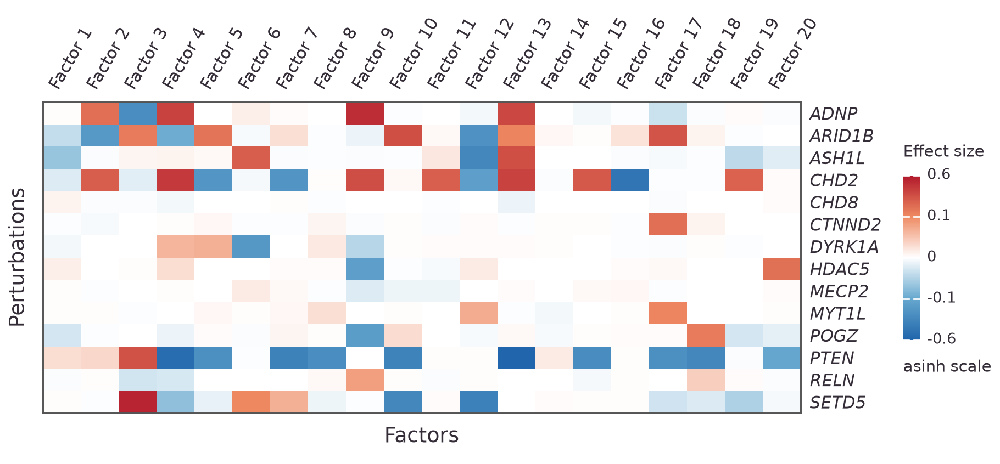
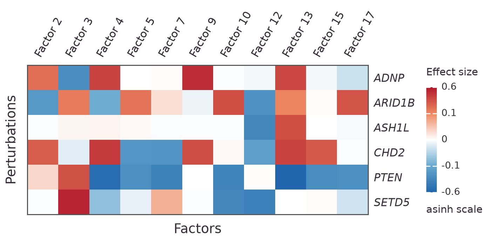
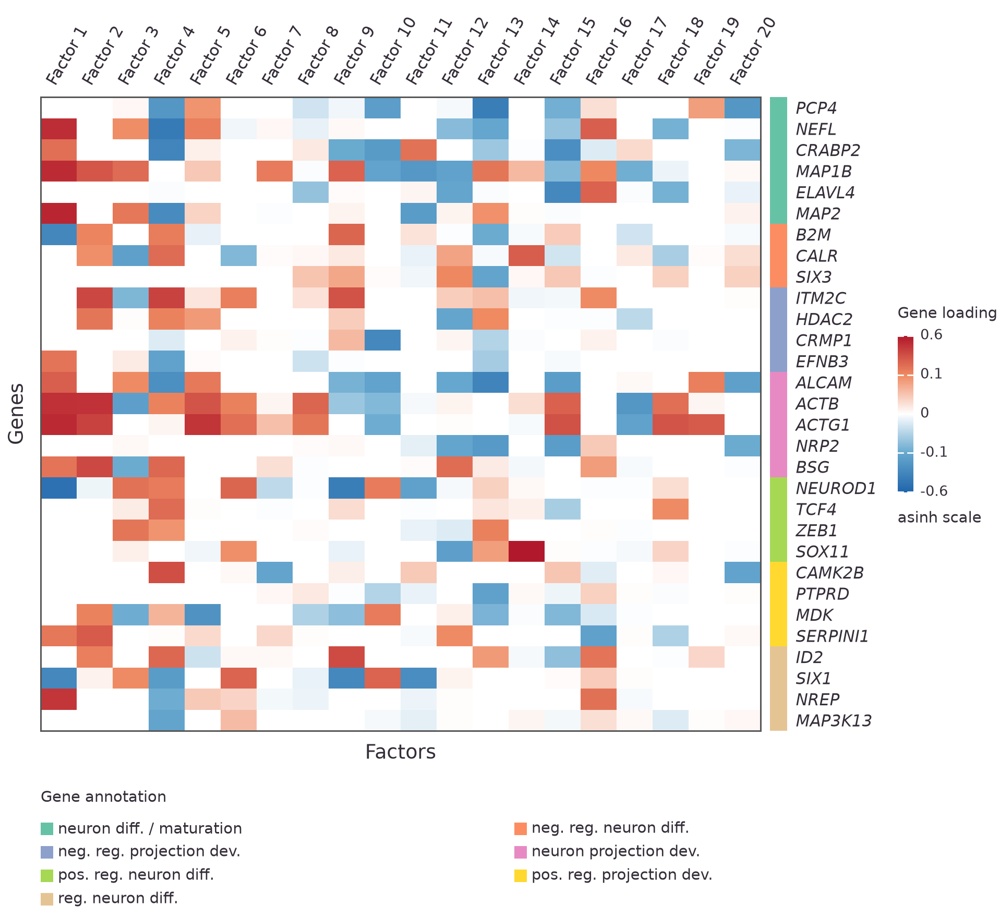
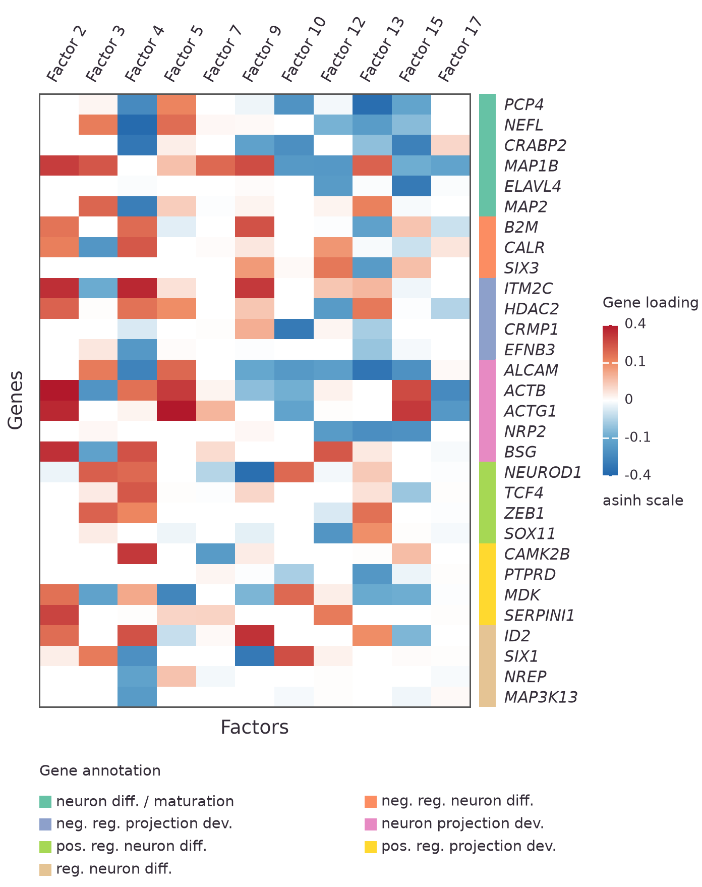
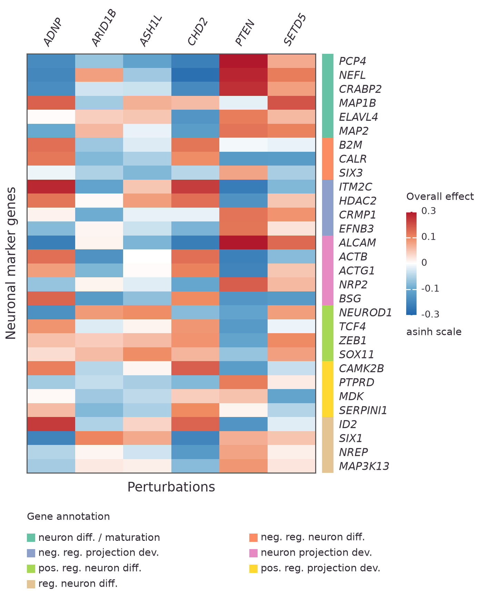
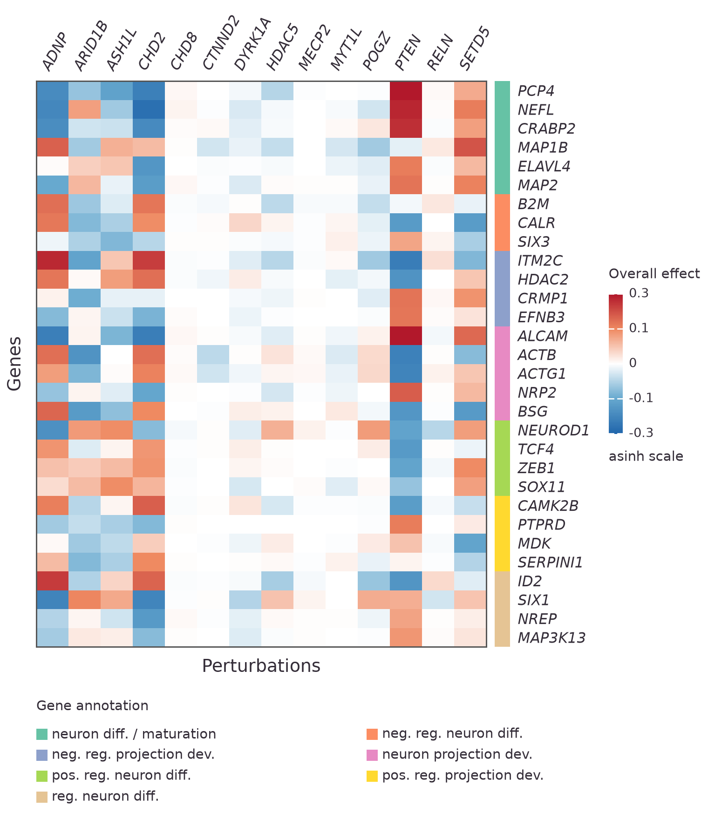
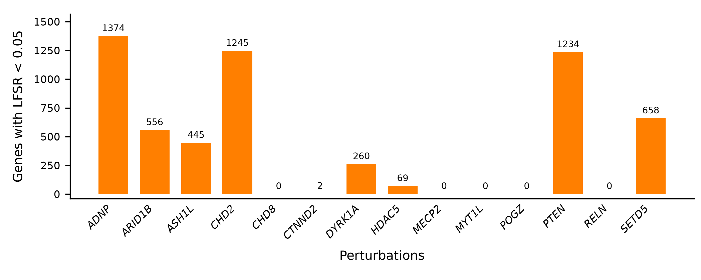
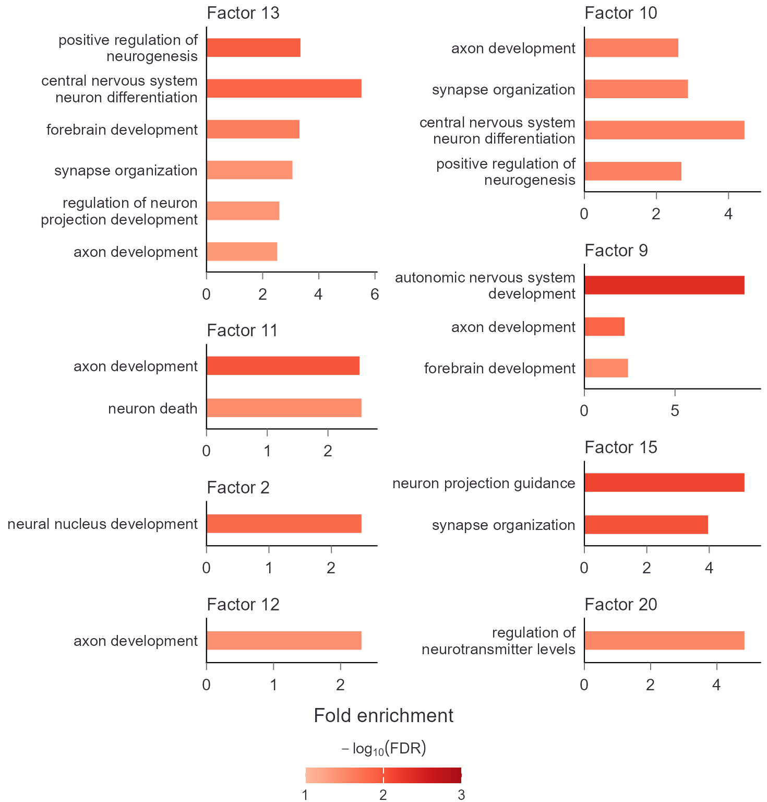

# LUHMES Analysis with PerturbVI

Fit the LUHMES screen, plot perturbation effects and gene loadings, then
examine neuronal GO enrichment in factor-associated genes.

!!! important
    To reproduce the analyses in the preprint: <br/>
    [zenodo.org/records/0000000](https://zenodo.org/records/0000000) (placeholder)

The example uses processed data from the
[Lalli et al. LUHMES screen](https://doi.org/10.1101/gr.262295.120), used in
the GSFA analysis: 8,708 cells, 6,000 genes, and 15 conditions.
The fit shown here used 20 factors and 1,000 single-effect loading components
per factor, with PCA initialization and seed 0. Initial `tau=100` was estimated
during fitting. With a 500-iteration limit and tolerance 0.001, fitting converged
at iteration 197.

Use your own gene selections and annotations to apply the plotting workflow
to another screen. The [general guide](workflow.md) covers other input formats
and perturbation designs.

For installation, see [Install PerturbVI](index.md#installation).

## 1. Prepare the LUHMES inputs

Use the processed expression and perturbation CSVs:

| File | Rows × columns | Contents |
|---|---|---|
| `luhmes/luhmes_exp.csv` | 8,708 cells × 6,000 genes | Processed, scaled expression; Ensembl gene IDs in the header |
| `luhmes/luhmes_G.csv` | 8,708 cells × 15 conditions | Binary assignments, including `Nontargeting` |

Both files have matching cell identifiers in the first column.
Expression is already covariate-corrected and scaled; no further normalization
or covariate correction is applied here.

??? example "Prepare these CSVs from the original data"
    Follow the [GSFA LUHMES preprocessing](https://xinhe-lab.github.io/GSFA_paper/preprocess_and_gsfa_LUHMES.html)
    starting from [GSE142078](https://www.ncbi.nlm.nih.gov/geo/query/acc.cgi?acc=GSE142078).
    After constructing `scaled.gene_exp` and `G_mat`, export them in R:

    ```r
    dir.create("luhmes", showWarnings = FALSE)
    write.csv(scaled.gene_exp, "luhmes/luhmes_exp.csv")
    write.csv(G_mat, "luhmes/luhmes_G.csv")
    ```

    Keep the Ensembl gene IDs as expression column names for GO enrichment.
    A GSFA model fit is not required to export these inputs.

## 2. Fit and save

Set the data and output paths, then fit. All 15 condition columns are retained
to match the example. `fit_screen()` centers each gene; `standardize=False`
avoids rescaling the already scaled expression.

```python
from pathlib import Path

import jax
import pandas as pd
from perturbvi import PerturbData, fit_screen, save_results

jax.config.update("jax_enable_x64", True)

data_dir = Path("luhmes")
result_dir = Path("luhmes_out")
expression = pd.read_csv(data_dir / "luhmes_exp.csv", index_col=0)
G = pd.read_csv(data_dir / "luhmes_G.csv", index_col=0)
data = PerturbData(
    X=expression,
    G=G,
)
fit = fit_screen(
    data,
    z_dim=20,
    l_dim=1000,
    init="pca",
    tau=100,
    standardize=False,
    max_iter=500,
    tol=0.001,
    seed=0,
    verbose=True,
)
save_results(
    fit,
    result_dir,
)
```

`z_dim` sets the factor count; `l_dim` sets the number of single-effect loading
components per factor. Neither is the number of posterior draws. The optional
LFSR calculation below uses 2,000 draws and seed 2026.

## 3. Understand the files

`save_results()` and the fitting CLI write `model.pkl` and six labeled CSVs.
Load each CSV as needed below. `LFSR_BW.csv` is generated separately.

| File | Rows × columns | Interpretation |
|---|---|---|
| `W.csv` | Factors × genes | Inclusion-weighted posterior mean loadings |
| `PIP_W.csv` | Factors × genes | Loading inclusion probabilities |
| `PVE.csv` | Factors × 1 | Per-factor expression variance summary |
| `B.csv` | Perturbations × factors | Inclusion-weighted mean effects on factors |
| `PIP_B.csv` | Perturbations × factors | Coefficient inclusion probabilities |
| `BW.csv` | Perturbations × genes | Overall effects, `B @ W` |
| `LFSR_BW.csv`, optional | Perturbations × genes | Overall-effect sign uncertainty |

LFSR (local false sign rate) measures uncertainty in an overall effect's sign.
Compute it for DEG counts or optional significance dots:

```bash
perturbvi lfsr luhmes_out --draws 2000 --seed 2026
```

The supplied `luhmes_out/` folder also contains `gene_annotations.csv`
and enrichment results. For a new fit, provide annotations as described below
and run the enrichment section. Reuse an existing LFSR CSV only for its matching fit.

## 4. Set up plotting

Install Matplotlib for plotting:

```bash
uv pip install matplotlib
```

Set `result_dir` to your fitted result directory. The examples below use
`luhmes_out/`; figures are saved separately in `figures/`.

```python
from pathlib import Path
import pandas as pd
import matplotlib.pyplot as plt
from perturbvi import plotting as pp

result_dir = Path("luhmes_out")
figure_dir = Path("figures")
figure_dir.mkdir(parents=True, exist_ok=True)

def save(fig, name):
    fig.savefig(
        figure_dir / f"{name}.png",
        dpi=300,
    )
    plt.close(fig)
```

Read matrices with `index_col=0` to preserve row identifiers. Plotting functions
accept individual pandas DataFrames and transpose gene matrices for display.

??? note "Use an in-memory fit or compute LFSR in Python"
    `estimate_lfsr()` accepts a saved directory or an in-memory `fit` and
    returns a DataFrame. Save it with pandas:

    ```python
    from perturbvi import estimate_lfsr

    LFSR_BW = estimate_lfsr(
        result_dir,
        draws=2000,
        seed=2026,
    )
    LFSR_BW.to_csv(result_dir / "LFSR_BW.csv")
    ```

    After fitting in Python, pass `fit.B`, `fit.W`, or `fit.BW` directly to
    a plotting function:

    ```python
    fig = pp.plot_factor_effects(
        fit.B,
        perturbations=["ADNP", "PTEN", "SETD5"],
        show_significance=False,
        scale="asinh",
    )
    ```

    `save_results(result_dir)` regenerates the six summary CSVs from a saved
    posterior without refitting.

The [API reference](api.md#plot-interpretation-tables) lists the plotting options.

## 5. Perturbation effects on factors

Plot all 14 targeting perturbations across all 20 factors, excluding the
`Nontargeting` control:

```python
B = pd.read_csv(result_dir / "B.csv", index_col=0)
fig = pp.plot_factor_effects(
    B,
    perturbations=B.index.drop("Nontargeting").tolist(),
    show_significance=False,
    scale="asinh",
)
save(fig, "01_factor_effects_full")
```

{ .luhmes-panel }

*Posterior mean effects on 20 factors across 14 targeting perturbations.
Red indicates positive effects; blue indicates negative effects.*

`scale="asinh"` uses `asinh(x / 0.03)` for color spacing; `scale="linear"`
uses the original scale. Legend labels remain in original units, rounded to
one decimal place. Five ticks are evenly spaced along the colorbar. Each plot
scales to its displayed values, so limits can differ between panels.

Colors show effect size. Significance dots are off by default
(`show_significance=False`). Use `cmap` to change colors and Matplotlib to
adjust fonts or other styling.

For a compact view, supply IDs in the desired order:

```python
fig = pp.plot_factor_effects(
    B,
    perturbations=["ADNP", "ARID1B", "ASH1L", "CHD2", "PTEN", "SETD5"],
    factors=["factor_1", "factor_2", "factor_3", "factor_4", "factor_6", "factor_8",
             "factor_9", "factor_11", "factor_12", "factor_14", "factor_16"],
    show_significance=False,
    scale="asinh",
)
save(fig, "01_factor_effects_subset")
```

{ .luhmes-panel }

*Six perturbations and eleven factors selected by repeatedly removing rows
and columns with fewer than two PIPs > 0.95 in the retained matrix. The plot
uses the supplied IDs; selection does not change the effect estimates.*

Factor IDs start at `factor_0`, displayed as "Factor 1". Subsets retain
these labels. To mark coefficient PIP > 0.95, read `PIP_B.csv` and pass
`pip=PIP_B` with `show_significance=True`.

## 6. Provide marker gene annotations

The example `gene_annotations.csv` contains 30 neuronal markers and regulators.
Use these three columns for your own gene selections:

| gene_ID | gene_name | annotation |
|---|---|---|
| ENSG00000183036 | PCP4 | neuron diff. / maturation |
| ENSG00000166710 | B2M | neg. reg. neuron diff. |
| ENSG00000277586 | NEFL | neuron diff. / maturation |

```python
annotations = pd.read_csv(result_dir / "gene_annotations.csv")
genes = annotations["gene_ID"].tolist()
```

`gene_ID` must be unique and match the fitted IDs. `gene_name` supplies the
display name; `annotation` supplies the group and legend label.

Genes are grouped automatically by annotation, even when their CSV rows are
separated. Groups follow their first appearance in the CSV; genes within each
group follow the supplied `genes` list. Unannotated genes appear last.
Omit `genes` to include all fitted genes.

The two-column legend appears below the heatmap. Labels are displayed as
written; shorten them or add line breaks in quoted CSV fields if needed.
Annotations are optional: without them, the plot shows fitted gene IDs in the
supplied order. Use established biological resources for annotations; these
labels are separate from model priors.

The LUHMES selection combines biological evidence and estimated effect sizes.
It illustrates neuronal responses but does not independently establish neuronal
specificity.

## 7. Gene loadings on factors

```python
W = pd.read_csv(result_dir / "W.csv", index_col=0)
fig = pp.plot_gene_loadings(
    W,
    genes=genes,
    gene_annotations=annotations,
    show_significance=False,
    scale="asinh",
)
save(fig, "02_gene_loadings_all_factors")
```

{ .luhmes-panel }

*Posterior mean loadings for 30 genes across 20 factors. The annotation strip
marks gene groups. No significance dots are shown.*

Use the same factor subset as the compact perturbation heatmap:

```python
fig = pp.plot_gene_loadings(
    W,
    genes=genes,
    factors=["factor_1", "factor_2", "factor_3", "factor_4", "factor_6", "factor_8",
             "factor_9", "factor_11", "factor_12", "factor_14", "factor_16"],
    gene_annotations=annotations,
    show_significance=False,
    scale="asinh",
)
save(fig, "02_gene_loadings_subset")
```

{ .luhmes-panel }

*Loadings for the same genes across the eleven selected factors.*

To mark loading PIP > 0.95, read `PIP_W.csv` and pass `pip=PIP_W` with
`show_significance=True`. Loadings already include inclusion weighting.

Interpret loadings together with perturbation effects: reversing both signs
for a factor leaves its overall gene contribution unchanged.

## 8. Overall perturbation effects on genes

Overall gene effects are the matrix product:

```python
overall = B @ W
```

`BW.csv` stores this product with perturbations on rows and genes on columns.
It includes **all fitted factors**, regardless of any plotting subsets.

```python
BW = pd.read_csv(result_dir / "BW.csv", index_col=0)
fig = pp.plot_gene_effects(
    BW,
    genes=genes,
    perturbations=["ADNP", "ARID1B", "ASH1L", "CHD2", "PTEN", "SETD5"],
    gene_annotations=annotations,
    show_significance=False,
    scale="asinh",
)
fig.axes[0].set_ylabel("Neuronal marker genes")
save(fig, "03_gene_effects_subset")
```

{ .luhmes-panel }

*Overall effects of six perturbations on the 30 selected genes. All estimates
are shown, without significance dots or masking.*

To include every targeting condition:

```python
fig = pp.plot_gene_effects(
    BW,
    genes=genes,
    perturbations=BW.index.drop("Nontargeting").tolist(),
    gene_annotations=annotations,
    show_significance=False,
    scale="asinh",
)
save(fig, "03_gene_effects_all_targets")
```

{ .luhmes-panel }

*Overall effects under all 14 targeting conditions. Omitting `perturbations`
also includes the modeled control.*

To add dots for LFSR < 0.05, load the LFSR matrix and enable significance:

```python
LFSR_BW = pd.read_csv(result_dir / "LFSR_BW.csv", index_col=0)
fig = pp.plot_gene_effects(
    BW,
    lfsr=LFSR_BW,
    genes=genes,
    perturbations=["ADNP", "PTEN", "SETD5"],
    gene_annotations=annotations,
    show_significance=True,
    scale="asinh",
)
plt.close(fig)
```

This optional call adds dots using the supplied LFSR values. A nonzero effect
can have LFSR ≥ 0.05; color alone does not establish significance.

## 9. Count significant genes

Count factor-associated genes using PIP > 0.95 and DEGs per perturbation using
LFSR < 0.05. The example also extracts the ADNP DEG list.

```python
PIP_W = pd.read_csv(result_dir / "PIP_W.csv", index_col=0)
LFSR_BW = pd.read_csv(result_dir / "LFSR_BW.csv", index_col=0)
factor_gene_counts = (PIP_W > 0.95).sum(axis=1)
deg_mask = LFSR_BW < 0.05
deg_counts = deg_mask.sum(axis=1)
adnp_degs = deg_mask.columns[deg_mask.loc["ADNP"]].tolist()
```

Plot the counts:

```python
fig, ax = plt.subplots(figsize=(7, 2.8))
values = deg_counts.drop("Nontargeting")
ax.bar(values.index, values.values, color="#FF7F00", width=0.72)
ax.set(xlabel="Perturbations", ylabel="Genes with LFSR < 0.05")
ax.set_ylim(-0.03 * max(values), 1.14 * max(values))
ax.spines[["top", "right"]].set_visible(False)
ax.tick_params(axis="x", rotation=45, length=0, labelsize=7.5)
ax.tick_params(axis="y", labelsize=7.5)
for tick in ax.get_xticklabels():
    tick.set(ha="right", fontstyle="italic")
ax.xaxis.label.set_fontsize(9)
ax.yaxis.label.set_fontsize(9)
ax.xaxis.labelpad = ax.yaxis.labelpad = 6
for i, value in enumerate(values):
    ax.text(i, value + 0.018 * max(values), str(value),
            ha="center", va="bottom", fontsize=6.5)
fig.subplots_adjust(left=0.10, right=0.99, bottom=0.29, top=0.95)
save(fig, "04_deg_counts")
```

{ .luhmes-panel }

*DEG counts at LFSR < 0.05. Summing bars counts gene–perturbation pairs;
`deg_mask.any(axis=0).sum()` counts distinct DEGs across perturbations.*

## 10. GO enrichment in R

Use [WebGestaltR](https://bzhanglab.github.io/WebGestaltR/reference/WebGestaltR.html)
for over-representation analysis (ORA) of factor-associated genes, following
the [GSFA workflow](https://xinhe-lab.github.io/GSFA_paper/gsfa_result_interpret_LUHMES.html).
This example uses human GO Biological Process terms. Install the R packages:

```r
install.packages(c("WebGestaltR", "ggplot2", "cowplot", "RColorBrewer",
                   "scales", "stringr", "ragg"))
```

Create one foreground gene list per factor from `PIP_W.csv`:

```r
result_dir <- "luhmes_out"
PIP_W <- read.csv(
  file.path(result_dir, "PIP_W.csv"),
  row.names = 1,
  check.names = FALSE
)
background <- colnames(PIP_W)
foregrounds <- lapply(as.data.frame(t(PIP_W)), function(probability) {
  background[probability > 0.95]
})
```

Use **all modeled genes** as background. Foregrounds include genes with
positive or negative loadings. WebGestaltR retrieves the human GO collection
and maps Ensembl IDs internally, so this step requires internet access.
`isOutput=FALSE` suppresses its report files and returns results in R:

```r
library(WebGestaltR)
results <- lapply(foregrounds, function(foreground) {
  if (!length(foreground)) return(NULL)
  WebGestaltR::WebGestaltR(
    enrichMethod = "ORA", organism = "hsapiens",
    enrichDatabase = "geneontology_Biological_Process_noRedundant",
    interestGene = foreground, interestGeneType = "ensembl_gene_id",
    referenceGene = background, referenceGeneType = "ensembl_gene_id",
    minNum = 10, maxNum = 500,
    fdrMethod = "BH", sigMethod = "fdr", fdrThr = 0.05, isOutput = FALSE
  )
})
```

WebGestaltR returns a table for each factor. The code below adds the factor ID
(`group`), selects and renames the returned columns, and saves them together as
**`enrichment/factor_go.csv`**. This is the only enrichment file needed for plotting;
the filename and CSV export are defined here, not by WebGestaltR.

```r
enrichment <- do.call(rbind, lapply(names(results), function(id) {
  ans <- results[[id]]
  if (is.null(ans) || !nrow(ans)) return(NULL)
  # group is the fitted factor ID; the other values come directly from WebGestaltR.
  data.frame(group = id, term_id = ans$geneSet, description = ans$description,
             fold_enrichment = ans$enrichmentRatio, fdr = ans$FDR,
             overlap = ans$overlap, p_value = ans$pValue)
}))
dir.create(file.path(result_dir, "enrichment"), showWarnings = FALSE)
write.csv(enrichment, file.path(result_dir, "enrichment", "factor_go.csv"), row.names = FALSE)
```

| Setting | Illustrated analysis |
|---|---|
| Foreground | Loading PIP > 0.95 per factor |
| Supplied background | All 6,000 modeled genes |
| Effective mapped/annotated background | 4,918 distinct Entrez genes |
| Collection | GO Biological Process, non-redundant |
| Gene-set size | 10–500 genes after background restriction |
| Test | WebGestaltR hypergeometric ORA |
| Multiple testing | BH across 734 eligible terms separately per factor |
| Significance | FDR < 0.05 |
| Software | WebGestaltR 0.4.6; R 4.5.0 |

The saved WebGestaltR results contain **282 significant factor-term associations**,
covering 148 terms and 18 factors.

## 11. Plot neuronal enrichment

Use ggplot2 and cowplot to show fold enrichment as bar length and −log10(FDR)
as color. Load the supplied results, or use the `enrichment` table created above:

```r
enrichment <- read.csv("luhmes_out/enrichment/factor_go.csv")
```

Select neuronal terms **after** ORA and Benjamini–Hochberg (BH) correction
across all eligible terms. The keyword filter changes only the displayed terms.

??? example "Draw the factor enrichment panels"

    ```r
    library(ggplot2)
    library(cowplot)

    plot_factor_go <- function(enrichment) {
      data <- subset(enrichment, fdr < 0.05)
      pattern <- paste0("neuron|neural|neurogen|nervous|axon|dendrit|brain|cerebr|",
                        "cerebell|hippocamp|synap|neurotrans|glia|myelin")
      data <- data[grepl(pattern, data$description, ignore.case = TRUE), ]
      if (!nrow(data)) stop("No enriched terms in this selection.")
      data$Factor <- as.integer(sub("^factor_", "", data$group)) + 1L
      data <- data[order(data$Factor, data$fdr, data$p_value, data$term_id), ]
      data$score <- -log10(data$fdr)
      palette <- RColorBrewer::brewer.pal(9, "Reds")[3:8]
      ids <- unique(data$Factor)
      weights <- vapply(ids, function(id) {
        .44 + .23 * sum(data$Factor == id)
      }, numeric(1))
      width <- 4.90
      height <- 5.12
      n_columns <- 2L

      plots <- setNames(lapply(ids, function(id) {
        d <- data[data$Factor == id, ]
        d$label <- factor(d$term_id, levels = rev(d$term_id))
        ggplot(d, aes(fold_enrichment, label)) +
          geom_segment(aes(x = 0, xend = fold_enrichment, yend = label, color = score),
                       linewidth = 4, lineend = "butt") +
          scale_x_continuous(limits = c(0, max(d$fold_enrichment) * 1.10),
                             breaks = scales::breaks_pretty(n = 3), expand = expansion(mult = 0)) +
          scale_y_discrete(labels = setNames(stringr::str_wrap(d$description, 26), d$term_id),
                           expand = expansion(add = .5)) +
          scale_color_gradientn(colors = palette, limits = c(1, 3), oob = scales::squish,
                                breaks = c(1, 2, 3), name = expression(-log[10](FDR))) +
          labs(title = paste("Factor", id), x = NULL, y = NULL) +
          theme_classic(base_size = 8) +
          theme(text = element_text(color = "#342D38"),
                plot.title = element_text(size = 8, face = "plain", margin = margin(b = 2)),
                plot.title.position = "panel",
                axis.text.y = element_text(size = 7, lineheight = .90, margin = margin(r = 4)),
                axis.text.x = element_text(size = 7.5, margin = margin(t = 4)),
                axis.line = element_line(color = "black", linewidth = .25),
                axis.ticks = element_line(color = "#77717C", linewidth = .22),
                axis.ticks.y = element_blank(), axis.ticks.length = grid::unit(1.2, "mm"),
                legend.position = "none", plot.margin = margin(3, 3, 6, 4))
      }), as.character(ids))

      # Distribute factors across columns according to their required height.
      columns <- rep(list(integer()), n_columns)
      heights <- numeric(n_columns)
      for (i in order(-weights, ids)) {
        column <- which.min(round(heights, 10))
        columns[[column]] <- c(columns[[column]], i)
        heights[column] <- heights[column] + weights[i]
      }
      panels <- lapply(columns[lengths(columns) > 0], function(indices) {
        plot_grid(plotlist = plots[as.character(ids[indices])], ncol = 1,
                  rel_heights = weights[indices], align = "v", axis = "lr")
      })
      body <- plot_grid(plotlist = panels, ncol = length(panels))

      # Compact, centered color key with white inward ticks.
      key <- ggdraw()
      x <- (width - 1) / (2 * width)
      shades <- scales::gradient_n_pal(palette)(seq(0, 1, length.out = 257))
      key <- key + draw_grob(grid::rectGrob(
        x = x + (seq_along(shades) - .5) / (257 * width), y = .425,
        width = 1 / (257 * width), height = .25,
        gp = grid::gpar(fill = shades, col = NA)))
      for (i in 1:3) {
        position <- x + (i - 1) / (2 * width)
        key <- key + draw_grob(grid::segmentsGrob(
          x0 = rep(position, 2), x1 = rep(position, 2),
          y0 = c(.30, .55), y1 = c(.39, .46),
          gp = grid::gpar(col = "white", lwd = .65))) +
          draw_label(if (i == 3 && any(data$score > 3)) "3+" else as.character(i),
                     x = position, y = .0375, vjust = 0, size = 6.5, color = "#342D38")
      }
      key <- key + draw_label(expression(-log[10](FDR)), x = .5, y = .99,
                               vjust = 1, size = 7, color = "#342D38")
      x_title <- ggdraw() + draw_label("Fold enrichment", x = .5, y = 1,
                                       vjust = 1, size = 9, color = "#342D38")
      figure <- plot_grid(body, x_title, key, ncol = 1,
                          rel_heights = c(height - .60, .20, .40))
      list(figure = figure, width = width, height = height)
    }

    dir.create("figures", showWarnings = FALSE)
    result <- plot_factor_go(enrichment)
    ggsave("figures/05_factor_enrichment_neuronal.png", result$figure,
           width = result$width, height = result$height, units = "in",
           dpi = 300, device = ragg::agg_png, bg = "white", limitsize = FALSE)
    ```

{ .luhmes-panel }

*Twenty significant associations covering eleven neuronal GO terms and eight
factors. Bars show fold enrichment, with separate x-axis ranges per factor.
Color shows −log10(FDR), capped at 3; the underlying FDR values are unchanged.*

The keyword filter is exploratory and can be adapted to another biological
question. Keep the FDR values from the full enrichment analysis when selecting
terms for display.

For enrichment of perturbation DEGs, use genes with LFSR < 0.05 from `LFSR_BW.csv`
as foregrounds and all modeled genes as background.
